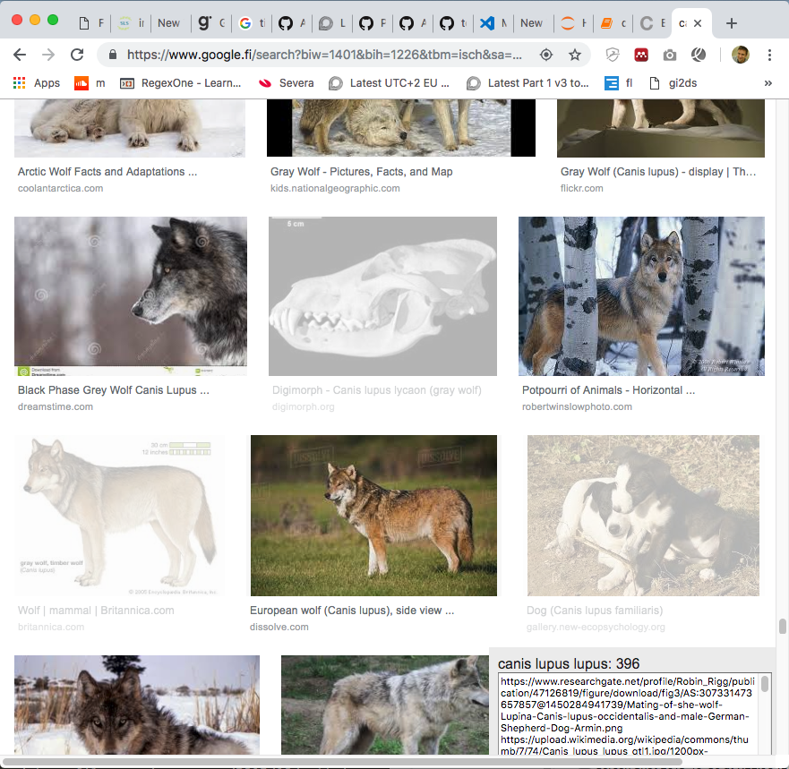
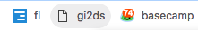

# gi2ds - Google Image Search 2 Dataset
**gi2ds** is intened to help you when creating an image dataset based on a google images query. It allows you to exclude images that are not relevant by toggling them on and off by clicking on them. Default is that all images are included. The urls are found in a popup down to the right. You need to scroll all the way down for more images to load, also pressing the `show more results` button and continuing scrolling in order to get all the pictures available.



## Getting started
You can either use this bookmarklet <a class="bookmarklet" href="javascript:(function()%7B(function(e%2C%20s)%20%7Be.src%20%3D%20s%3Be.onload%20%3D%20function()%20%7BjQuery.noConflict()%3BjQuery('%3Cstyle%20type%3D%22text%2Fcss%22%3E%20.remove%20%7B%20opacity%3A0.3%3B%7D%5Cn%20.urlmodal%20%7Bpadding%3A%2010px%3B%20background-color%3A%20%23eee%3B%20position%3A%20fixed%3B%20bottom%3A%200%3B%20right%3A%200%3B%20height%3A%20100px%3B%20width%3A%20300px%3B%20z-index%3A%201000%3B%7D%20.urlmodal%20textarea%20%7Bwidth%3A%20100%25%3B%20height%3A%20250px%3B%7D%3C%2Fstyle%3E').appendTo('head')%3BjQuery('%3Cdiv%20class%3D%22urlmodal%22%3E%3Ch3%3ELet%5C's%20create%20a%20dataset%3C%2Fh3%3E%3Ctextarea%3EScoll%20all%20the%20way%20down%5CnClick%20%22Show%20more%20images%22%5CnScroll%20more%5CnClick%20on%20the%20images%20you%20want%20to%20remove%20from%20the%20dataset%5CnThe%20urls%20will%20appear%20in%20this%20box%20for%20you%20to%20copy.%3C%2Ftextarea%3E%3C%2Fdiv%3E').appendTo('body')%3BjQuery('%23rg').on('click'%2C%20'.rg_di'%2C%20function()%20%7BjQuery(this).toggleClass('remove')%3BupdateUrls()%3Breturn%20false%3B%7D)%3BjQuery(window).scroll(updateUrls)%3BjQuery('.urlmodal%20textarea').focus(function()%20%7BupdateUrls()%3B%20setTimeout(selectText%2C%20100)%7D).mouseup(function()%20%7Breturn%20false%3B%7D)%3Bfunction%20updateUrls()%20%7Bvar%20urls%20%3D%20Array.from(document.querySelectorAll('.rg_di%3Anot(.remove)%20.rg_meta')).map(el%3D%3EJSON.parse(el.textContent).ou)%3Bvar%20search_term%20%3D%20jQuery('.gsfi').val()%3BjQuery('.urlmodal%20textarea').val(urls.join(%22%5Cn%22))%3BjQuery('.urlmodal%20h3').html(search_term%20%2B%20%22%3A%20%22%20%2B%20urls.length)%3B%7Dfunction%20selectText()%20%7BjQuery('.urlmodal%20textarea').select()%3B%7D%7D%3Bdocument.head.appendChild(e)%3B%7D)(document.createElement('script')%2C%20'%2F%2Fcode.jquery.com%2Fjquery-latest.min.js')%7D)()" style="padding:3px 15px; background: #E4E7EA; color:#333; border-radius:5px">gi2ds</a>  (for more info [see below](#bookmarklet)) or paste  the following JavaScript code into the browsers javascript console on the image search results page.

```javascript
(function(e, s) {
    e.src = s;
    e.onload = function() {
        jQuery.noConflict();
        jQuery('<style type="text/css"> .remove { opacity:0.3;}\n .urlmodal {padding: 10px; background-color: #eee; position: fixed; bottom: 0; right: 0; height: 100px; width: 300px; z-index: 1000;} .urlmodal textarea {width: 100%; height: 250px;}</style>').appendTo('head');
        jQuery('<div class="urlmodal"><h3>Let\'s create a dataset</h3><textarea>Scoll all the way down\nClick "Show more images"\nScroll more\nClick on the images you want to remove from the dataset\nThe urls will appear in this box for you to copy.</textarea></div>').appendTo('body');

        jQuery('#rg').on('click', '.rg_di', function() {
            jQuery(this).toggleClass('remove');
            updateUrls();
            return false;
        });
        jQuery(window).scroll(updateUrls);
        jQuery('.urlmodal textarea').focus(function() {updateUrls(); setTimeout(selectText, 100)}).mouseup(function() {return false;});

        function updateUrls() {
            var urls = Array.from(document.querySelectorAll('.rg_di:not(.remove) .rg_meta')).map(el=>JSON.parse(el.textContent).ou);
            var search_term = jQuery('.gsfi').val();
            jQuery('.urlmodal textarea').val(urls.join("\n"));
            jQuery('.urlmodal h3').html(search_term + ": " + urls.length);
        }

        function selectText() {
            jQuery('.urlmodal textarea').select();
        }
    };
    document.head.appendChild(e);
})(document.createElement('script'), '//code.jquery.com/jquery-latest.min.js');
```

## Adding a bookmarklet
<a name="bookmarklet"></a>
Add this snippet:

<textarea cols="80" rows="3">javascript:(function()%7B(function(e%2C%20s)%20%7Be.src%20%3D%20s%3Be.onload%20%3D%20function()%20%7BjQuery.noConflict()%3BjQuery('%3Cstyle%20type%3D%22text%2Fcss%22%3E%20.remove%20%7B%20opacity%3A0.3%3B%7D%5Cn%20.urlmodal%20%7Bpadding%3A%2010px%3B%20background-color%3A%20%23eee%3B%20position%3A%20fixed%3B%20bottom%3A%200%3B%20right%3A%200%3B%20height%3A%20100px%3B%20width%3A%20300px%3B%20z-index%3A%201000%3B%7D%20.urlmodal%20textarea%20%7Bwidth%3A%20100%25%3B%20height%3A%20250px%3B%7D%3C%2Fstyle%3E').appendTo('head')%3BjQuery('%3Cdiv%20class%3D%22urlmodal%22%3E%3Ch3%3ELet%5C's%20create%20a%20dataset%3C%2Fh3%3E%3Ctextarea%3EScoll%20all%20the%20way%20down%5CnClick%20%22Show%20more%20images%22%5CnScroll%20more%5CnClick%20on%20the%20images%20you%20want%20to%20remove%20from%20the%20dataset%5CnThe%20urls%20will%20appear%20in%20this%20box%20for%20you%20to%20copy.%3C%2Ftextarea%3E%3C%2Fdiv%3E').appendTo('body')%3BjQuery('%23rg').on('click'%2C%20'.rg_di'%2C%20function()%20%7BjQuery(this).toggleClass('remove')%3BupdateUrls()%3Breturn%20false%3B%7D)%3BjQuery(window).scroll(updateUrls)%3BjQuery('.urlmodal%20textarea').focus(function()%20%7BupdateUrls()%3B%20setTimeout(selectText%2C%20100)%7D).mouseup(function()%20%7Breturn%20false%3B%7D)%3Bfunction%20updateUrls()%20%7Bvar%20urls%20%3D%20Array.from(document.querySelectorAll('.rg_di%3Anot(.remove)%20.rg_meta')).map(el%3D%3EJSON.parse(el.textContent).ou)%3Bvar%20search_term%20%3D%20jQuery('.gsfi').val()%3BjQuery('.urlmodal%20textarea').val(urls.join(%22%5Cn%22))%3BjQuery('.urlmodal%20h3').html(search_term%20%2B%20%22%3A%20%22%20%2B%20urls.length)%3B%7Dfunction%20selectText()%20%7BjQuery('.urlmodal%20textarea').select()%3B%7D%7D%3Bdocument.head.appendChild(e)%3B%7D)(document.createElement('script')%2C%20'%2F%2Fcode.jquery.com%2Fjquery-latest.min.js')%7D</textarea>

as the ULR of a new bookmark in your bookmarks bar and name it gi2ds.

I will become a button you can press instead of pasting the code into the JavaScript console.



### Inspiration
Inspiration comes from this years [fast.ai](https://www.fast.ai/) course (v3) where i am attending as an International Fellow. The course will be available to the public in January 2019